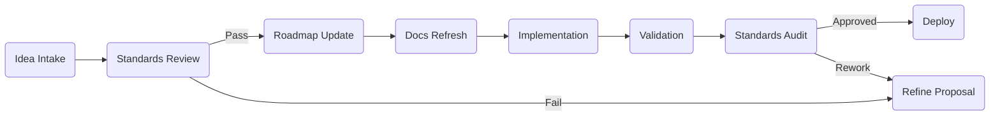

# AS AI Development Standards

**Purpose:** Provide authoritative guidance for human or AI-assisted work on the Amazingly Strange Website, enforcing consistent architecture, documentation, and accessibility practices.

**Date Created:** 2025-11-02  
**Last Updated:** 2025-11-02

---

## ✅ Compliance Suite

| Layer | Required Artifact | Key Contents | Visual Aid |
|-------|-------------------|--------------|------------|
| 1 | `AS_EXEC_SUMMARY.md` | Mission, audience, release target | ✅ Summary table |
| 2 | `AS_ROADMAP.md` | NOW/NEXT/LATER, acceptance checklist | ✅ Timeline |
| 3 | `AS_OVERVIEW.md` | Architecture, feature set, dependencies | ✅ Diagrams |
| 4 | `AS_INDEX.md` | Document inventory, owners, change log | ✅ Table |
| 5 | `AS_AI_PROMPT.md` | Canonical AI orchestration prompt | ✅ Flow chart |

All five artifacts must be refreshed and linked in pull requests that modify behavior or documentation.

---

## 🧭 Engineering Principles

```
╔════════════════════════════════════════════════╗
║ SOLID • DRY • KISS • YAGNI • SSOT • COMPOSITION ║
║ Separation of Concerns • Law of Demeter        ║
║ Explicitness • Clean Boundaries • Immutable Core║
╚════════════════════════════════════════════════╝
```

1. **SOLID & DRY** – Each module has a single responsibility; duplication triggers refactoring.
2. **KISS** – Prefer the simplest implementation that satisfies acceptance tests.
3. **YAGNI** – Build only what the roadmap requires today.
4. **Single Source of Truth** – Environment variables and content state originate from one owner.
5. **Composition over Inheritance** – Compose content experiences from small components.
6. **Separation of Concerns** – UI cannot mutate content without going through Supabase clients.
7. **Law of Demeter** – Components talk only to direct collaborators.
8. **Explicitness** – Function names and side effects must be obvious; document non-trivial flows.
9. **Clean Boundaries** – `src/lib` never depends on UI; middleware remains stateless.
10. **Immutable Core** – Treat server-side auth data as immutable snapshots unless explicitly updated.

Document any intentional deviation with mitigation steps and resolution timeline.

---

## 🔁 Compliance Workflow



- **Standards Review** – Confirm roadmap alignment and data ownership.
- **Docs Refresh** – Update required artifacts listed above with timestamps.
- **Validation** – Add/adjust automated tests and manual checklists.
- **Audit** – Peers verify compliance before merge or release.

---

## 📊 Data Flow Template

```
┌──────────────┐    events/state    ┌────────────────────┐
│ Content Core │ ─────────────────▶ │ Integration Layer  │
│ (Immutable)  │                   │ (Supabase SDK)      │
└────┬─────────┘                   └─────────┬──────────┘
     │ refresh snapshots                      │ exposes DTOs
     ▼                                        ▼
┌──────────────┐    renders/binds    ┌────────────────────┐
│ UI View Model│ ─────────────────▶ │ Next.js Components  │
└──────────────┘                   └─────────────────────┘
```

Customize node names when architecture evolves and sync diagrams across docs.

---

## 🌲 Repository Snapshot Requirement

```bash
$ tree -L 2 docs
docs
├── AS_AI_PROMPT.md
├── AS_AI_STANDARDS.md
├── AS_API.md
├── AS_DEVELOPMENT.md
├── AS_EXEC_SUMMARY.md
├── AS_INDEX.md
├── AS_OVERVIEW.md
├── AS_ROADMAP.md
└── AS_STANDARDS.md
```

Maintain this layout (plus authorized additions) for every release.

---

## 🧪 Validation Checklist

| Check | Description | Owner |
|-------|-------------|-------|
| ✅ Tests cover new behavior | Feature Developer |
| ✅ Docs updated & timestamped | Doc Steward |
| ✅ Diagrams/tree current | Tech Lead |
| ✅ Manual acceptance noted | QA |
| ✅ Accessibility review logged | UX |

Record checklist outcomes in pull requests or release notes.

---

## 🛡 Waiver Process

- File a waiver issue with impacted principles, risk assessment, and expiry date.
- Assign an owner and add follow-up task to `AUTH_ROADMAP.md`.
- Waivers older than two sprints reopen as blocking defects.

---

## 🔄 Continuous Improvement

1. Capture release metrics (escaped defects, doc drift) after each deployment.
2. Map incidents to violated principles; adjust standards if needed.
3. Track remediation work in the decision log within `AUTH_ROADMAP.md`.

---

## ♿ Accessibility Guidance

- Use high-contrast callouts, emoji legends, and concise bullet-first summaries.
- Keep paragraphs short (<4 lines) and favor active voice.
- Provide diagrams or tables alongside complex explanations.

---

## 🔗 Companion Documents

- `docs/AS_OVERVIEW.md`
- `docs/AS_ROADMAP.md`
- `docs/AS_INDEX.md`
- `docs/AS_AI_PROMPT.md`

Each companion document references this standard in its first or second section when relevant.

---

## 📌 Action Reminder

Review this standard before opening PRs or AI sessions. Non-compliance requires immediate remediation or rollback.
