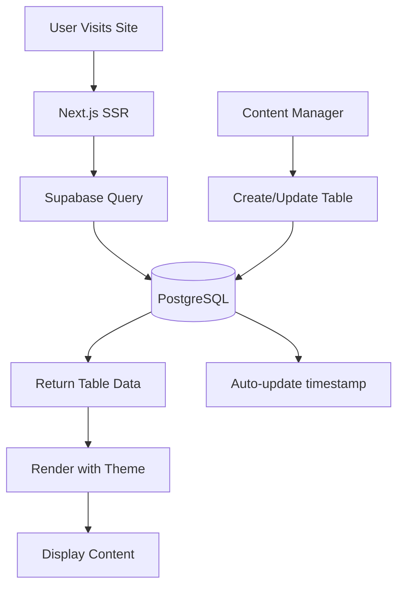

# AS API Documentation

## Overview

This reference explains the database schema, data flow, and content management system that powers the Amazingly Strange Website's dynamic table content.

## �️ Database Schema

The system uses Supabase PostgreSQL with three main tables for content management.

### Tables Table
```sql
CREATE TABLE public.tables (
    id uuid DEFAULT uuid_generate_v4() PRIMARY KEY,
    title text NOT NULL,
    layout text CHECK (layout IN ('1-col', '2-col', '3-col')) NOT NULL,
    theme jsonb NOT NULL DEFAULT '{}',
    content jsonb NOT NULL DEFAULT '{}',
    metadata jsonb DEFAULT '{}',
    is_published boolean DEFAULT false,
    created_at timestamptz DEFAULT now(),
    updated_at timestamptz DEFAULT now(),
    created_by uuid REFERENCES auth.users(id)
);
```

### Themes Table
```sql
CREATE TABLE public.themes (
    id uuid DEFAULT uuid_generate_v4() PRIMARY KEY,
    name text NOT NULL UNIQUE,
    description text,
    config jsonb NOT NULL,
    is_default boolean DEFAULT false,
    created_at timestamptz DEFAULT now()
);
```

### Uploads Table
```sql
CREATE TABLE public.uploads (
    id uuid DEFAULT uuid_generate_v4() PRIMARY KEY,
    filename text NOT NULL,
    file_path text NOT NULL,
    content_type text NOT NULL,
    file_size integer NOT NULL,
    created_by uuid REFERENCES auth.users(id),
    created_at timestamptz DEFAULT now()
);
```

## 🔄 Data Flow



## 🛣️ Data Access Patterns

### Fetch Published Tables
```typescript
const supabase = createClient();
const { data: tables } = await supabase
  .from('tables')
  .select('*')
  .eq('is_published', true)
  .order('created_at', { ascending: false });
```

### Get Theme Configuration
```typescript
const { data: theme } = await supabase
  .from('themes')
  .select('config')
  .eq('name', 'Emerald')
  .single();
```

### Upload File
```typescript
const { data, error } = await supabase.storage
  .from('uploads')
  .upload(fileName, file);
```

## 🔧 Supabase Clients

| Context | Factory | Purpose |
|---------|---------|---------|
| Browser | `createBrowserClient` | Client-side content fetching |
| Server  | `createServerClient`  | SSR content loading |

### Server-side content loading
```typescript
const supabase = createServerClient();
const { data: tables } = await supabase
  .from('tables')
  .select('*')
  .eq('is_published', true);
```

## � Testing Guidance

### Database Setup
Run `scripts/05-setup-database.sql` in Supabase SQL editor to initialize schema.

### Manual Data Checks
```sql
-- Check table counts
SELECT COUNT(*) FROM tables WHERE is_published = true;

-- Verify theme defaults
SELECT name, is_default FROM themes;

-- List recent uploads
SELECT filename, created_at FROM uploads ORDER BY created_at DESC LIMIT 5;
```

### Automated Test Ideas
- Test table queries return expected structure
- Verify RLS policies prevent unauthorized access
- Check theme config parsing
- Validate file upload constraints

## 🔄 Content Management

### Table Layouts
- **1-col**: Single column content
- **2-col**: Two column layout
- **3-col**: Three column layout

### Theme Structure
```json
{
  "colors": {
    "primary": "#47D7AC",
    "background": "rgba(71, 215, 172, 0.1)",
    "border": "rgba(71, 215, 172, 0.2)",
    "text": "#000000"
  }
}
```

## 📡 Observability

- Monitor Supabase query performance
- Track content loading times
- Log file upload activities

## 📚 Related Documentation

- `docs/AS_SETUP.md` – Database setup steps
- `docs/AS_DEVELOPMENT.md` – Content management workflow
- `docs/AS_STANDARDS.md` – Data validation policies
