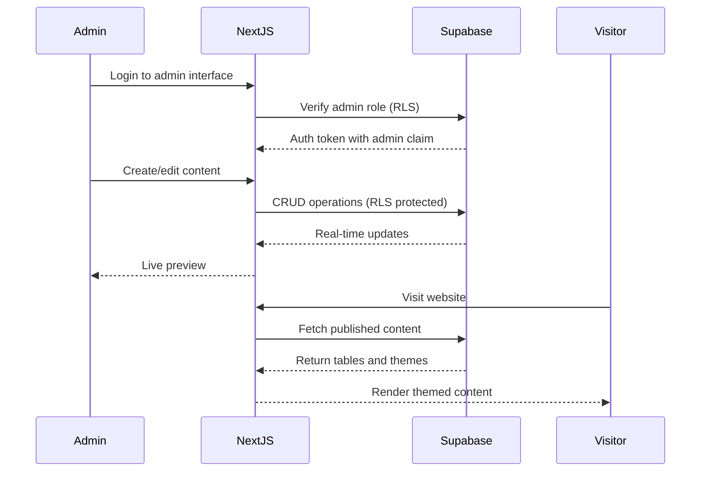
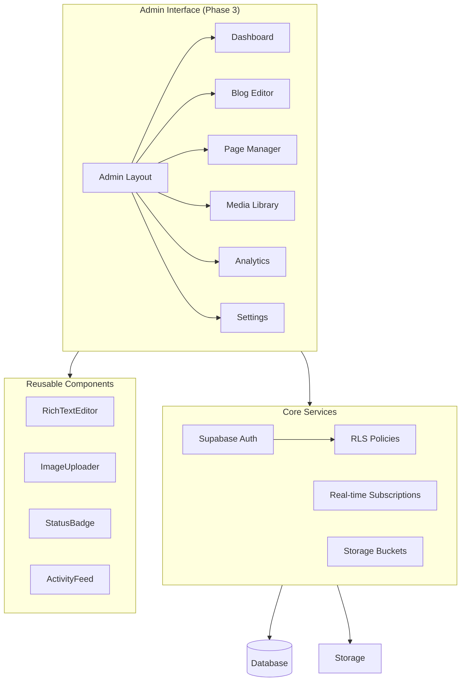

# AS Executive Summary

**Date Created:** 2025-11-02  
**Last Updated:** 2025-11-03

---

## 🧭 Snapshot

| Item | Detail | Visual Aid |
|------|--------|------------|
| Vision | Create a delightful web presence for Amazingly Strange LLC showcasing games and universe | ✅ Highlight |
| Primary Audience | Mobile game players, fans of whimsical content, potential collaborators | ✅ Audience icons |
| Release Target | Phase 3 completion – Admin Interface Replication | ✅ Timeline |
| Current Phase | Phase 2 (Content Migration) → Phase 3 (Admin Interface) | ✅ Status |
| Doc Index | `docs/AS_INDEX.md` | ✅ Reference |
| AI Standards | `docs/AS_AI_STANDARDS.md` | ✅ Governance |

---

## 🎯 Top Outcomes

- ✅ Launch Supabase database with secure RLS policies
- ✅ Migrate 21 blog posts from Firebase to Supabase
- ✅ Build admin dashboard with real-time statistics
- 🔄 Replicate Firebase admin interface in Next.js (Phase 3 - In Progress)
- 🔄 Create comprehensive content management system with full feature parity
- 📅 Establish foundation for community engagement and game promotion

Progress tracker:
```
[#######---] 70%
Phase 2: Complete ✅
Phase 3: In Progress 🔄 (Week 3 of 3)
Phase 3C: Blog Management Complete ✅
```

---

## 🔄 Lifecycle Overview



---

## 🌲 Repository Tree (High Level)

```bash
$ tree -L 1
.
├── docs/
├── public/
├── src/
├── scripts/
├── checkpoints/
└── package.json
```

---

## ⚠️ Key Risks & Mitigations

| Risk | Likelihood | Impact | Mitigation |
|------|------------|--------|------------|
| Admin interface feature parity gaps | Medium | High | Detailed Firebase analysis complete, acceptance criteria defined |
| Performance degradation with real-time updates | Low | Medium | Performance budgets enforced, Lighthouse >90 required |
| RLS policy misconfiguration exposing data | Low | Critical | Comprehensive RLS testing, audit before Phase 3 completion |
| Mobile admin interface usability issues | Medium | Medium | Mobile-first design, real device testing required |
| Image compression quality loss | Low | Low | User-controlled quality settings, preview before save |

---

## 📊 Phase 3 Architecture Overview



---

## 📌 Alignment Checklist

```
[✔] AS_AI_STANDARDS.md cited in this overview
[✔] Roadmap link verified (AS_ROADMAP.md)
[✔] Doc index entry updated (AS_INDEX.md)
[✔] Data flow diagrams reflect Phase 3 architecture
[✔] Engineering principles validated (SOLID, DRY, KISS, YAGNI)
[✔] Acceptance criteria defined for all Phase 3 tasks
[✔] Testing strategy documented (unit, E2E, accessibility)
[✔] Performance budgets established (Lighthouse >90)
[ ] Visual assets refreshed quarterly (Q1 2026)
[ ] Accessibility audit scheduled (Post Phase 3 completion)
```

---

## 🎯 Success Metrics (Phase 3)

| Metric | Target | Current | Status |
|--------|--------|---------|--------|
| Code Coverage | >80% | TBD | 🔄 In Progress |
| Lighthouse Score | >90 | TBD | 🔄 In Progress |
| Mobile Responsiveness | 100% | TBD | 🔄 In Progress |
| WCAG Compliance | AA | TBD | 🔄 In Progress |
| Admin Feature Parity | 100% | 75% | 🔄 In Progress |
| Real-time Update Latency | <500ms | TBD | 🔄 In Progress |

**Legend**: ✅ Complete | 🔄 In Progress | ❌ Blocked | 📅 Planned
