# DOCS Graph (generated)

Generated: 2026-01-01T15:25:28.210Z

This graph is generated from each doc's `relatedDocs` frontmatter. Nodes are docs; edges are explicit relatedDocs links.

```mermaid
flowchart LR
AMS_AMAZINGLYSTRANGE_ADMIN_md["AMS/AMAZINGLYSTRANGE_ADMIN.md"]
AMS_AMAZINGLYSTRANGE_AI_PROMPT_md["AMS/AMAZINGLYSTRANGE_AI_PROMPT.md"]
AMS_AMAZINGLYSTRANGE_FIREBASE_md["AMS/AMAZINGLYSTRANGE_FIREBASE.md"]
AMS_AMAZINGLYSTRANGE_FIREBASE_DEV_GUIDE_md["AMS/AMAZINGLYSTRANGE_FIREBASE_DEV_GUIDE.md"]
AMS_AMAZINGLYSTRANGE_INDEX_md["AMS/AMAZINGLYSTRANGE_INDEX.md"]
AMS_AMAZINGLYSTRANGE_LAYOUT_MANAGER_md["AMS/AMAZINGLYSTRANGE_LAYOUT_MANAGER.md"]
AMS_AMAZINGLYSTRANGE_ROADMAP_md["AMS/AMAZINGLYSTRANGE_ROADMAP.md"]
AMS_AMAZINGLYSTRANGE_RULES_md["AMS/AMAZINGLYSTRANGE_RULES.md"]
AMS_AMAZINGLYSTRANGE_SEO_GUIDE_md["AMS/AMAZINGLYSTRANGE_SEO_GUIDE.md"]
AMS_AMAZINGLYSTRANGE_TREE_md["AMS/AMAZINGLYSTRANGE_TREE.md"]
AMS_AMAZINGLYSTRANGE_WEB_STANDARDS_md["AMS/AMAZINGLYSTRANGE_WEB_STANDARDS.md"]
AMS_AMS_AI_PROMPT_md["AMS/AMS_AI_PROMPT.md"]
AMS_AMS_AI_STANDARDS_md["AMS/AMS_AI_STANDARDS.md"]
AMS_AMS_AND_MonstersReign_SETUP_md["AMS/AMS_AND_MonstersReign_SETUP.md"]
AMS_AMS_API_md["AMS/AMS_API.md"]
AMS_AMS_BRAND_HEADER_md["AMS/AMS_BRAND_HEADER.md"]
AMS_AMS_DEVELOPMENT_md["AMS/AMS_DEVELOPMENT.md"]
AMS_AMS_EXEC_SUMMARY_md["AMS/AMS_EXEC_SUMMARY.md"]
AMS_AMS_INDEX_md["AMS/AMS_INDEX.md"]
AMS_AMS_OVERVIEW_md["AMS/AMS_OVERVIEW.md"]
AMS_AMS_RELEASE_RUNBOOK_md["AMS/AMS_RELEASE_RUNBOOK.md"]
AMS_AMS_ROADMAP_md["AMS/AMS_ROADMAP.md"]
AMS_AMS_SETUP_md["AMS/AMS_SETUP.md"]
AMS_AMS_STANDARDS_md["AMS/AMS_STANDARDS.md"]
AMS_AMS_STATIC_BLOG_md["AMS/AMS_STATIC_BLOG.md"]
AMS_AMS_SUPABASE_DATABASE_md["AMS/AMS_SUPABASE_DATABASE.md"]
AMS_AMS_WEB_ROADMAP_md["AMS/AMS_WEB_ROADMAP.md"]
AMS_DOC_INDEX_md["AMS/DOC_INDEX.md"]
BUSINESS_BUSINESS_ADMIN_md["BUSINESS/BUSINESS_ADMIN.md"]
BUSINESS_BUSINESS_AI_PROMPT_md["BUSINESS/BUSINESS_AI_PROMPT.md"]
BUSINESS_BUSINESS_ARCHITECTURE_UPDATE_DEC2025_md["BUSINESS/BUSINESS_ARCHITECTURE_UPDATE_DEC2025.md"]
BUSINESS_BUSINESS_CHEAT_SHEET_md["BUSINESS/BUSINESS_CHEAT_SHEET.md"]
BUSINESS_BUSINESS_CHECKLIST_md["BUSINESS/BUSINESS_CHECKLIST.md"]
BUSINESS_BUSINESS_DATABASE_md["BUSINESS/BUSINESS_DATABASE.md"]
BUSINESS_BUSINESS_EMAIL_BREVO_md["BUSINESS/BUSINESS_EMAIL_BREVO.md"]
BUSINESS_BUSINESS_ENVIRONMENT_MGMT_md["BUSINESS/BUSINESS_ENVIRONMENT_MGMT.md"]
BUSINESS_BUSINESS_ROADMAP_md["BUSINESS/BUSINESS_ROADMAP.md"]
BUSINESS_BUSINESS_SCALABLE_FOUNDATION_md["BUSINESS/BUSINESS_SCALABLE_FOUNDATION.md"]
BUSINESS_BUSINESS_VERCEL_md["BUSINESS/BUSINESS_VERCEL.md"]
BUSINESS_BUSINESS_WORKSPACES_md["BUSINESS/BUSINESS_WORKSPACES.md"]
BUSINESS_DOC_INDEX_md["BUSINESS/DOC_INDEX.md"]
BUSINESS_MAGICWRX_CUSTOMER_BRANDED_EMAIL_OPTION_A_md["BUSINESS/MAGICWRX_CUSTOMER_BRANDED_EMAIL_OPTION_A.md"]
CODE_CODE_LEDGER_md["CODE/CODE_LEDGER.md"]
CONSOLIDATION_SUMMARY_md["CONSOLIDATION_SUMMARY.md"]
DOCS_DOC_SCRIPT_MAP_md["DOCS_DOC_SCRIPT_MAP.md"]
GENERIC_AI_STANDARDS_md["GENERIC/AI_STANDARDS.md"]
GENERIC_GENERIC_AI_PROMPT_md["GENERIC/GENERIC_AI_PROMPT.md"]
GENERIC_GENERIC_DOC_INDEX_md["GENERIC/GENERIC_DOC_INDEX.md"]
GENERIC_GENERIC_ROADMAP_md["GENERIC/GENERIC_ROADMAP.md"]
GENERIC_GENERIC_TITLE_OVERVIEW_md["GENERIC/GENERIC_TITLE_OVERVIEW.md"]
MAGICWRX_ADSENSE_TOOLING_md["MAGICWRX/ADSENSE_TOOLING.md"]
MAGICWRX_MAGICWRX_AI_PROMPT_md["MAGICWRX/MAGICWRX_AI_PROMPT.md"]
MAGICWRX_MAGICWRX_AUTH_SETUP_md["MAGICWRX/MAGICWRX_AUTH_SETUP.md"]
MAGICWRX_MAGICWRX_DEPLOYMENT_md["MAGICWRX/MAGICWRX_DEPLOYMENT.md"]
MAGICWRX_MAGICWRX_DESIGN_SYSTEM_STRATEGY_md["MAGICWRX/MAGICWRX_DESIGN_SYSTEM_STRATEGY.md"]
MAGICWRX_MAGICWRX_DOC_INDEX_md["MAGICWRX/MAGICWRX_DOC_INDEX.md"]
MAGICWRX_MAGICWRX_EXECUTIVE_V2_md["MAGICWRX/MAGICWRX_EXECUTIVE_V2.md"]
MAGICWRX_MAGICWRX_HARMONY_md["MAGICWRX/MAGICWRX_HARMONY.md"]
MAGICWRX_MAGICWRX_MIGRATION_PLAN_md["MAGICWRX/MAGICWRX_MIGRATION_PLAN.md"]
MAGICWRX_MAGICWRX_RECAPTCHA_md["MAGICWRX/MAGICWRX_RECAPTCHA.md"]
MAGICWRX_MAGICWRX_ROADMAP_md["MAGICWRX/MAGICWRX_ROADMAP.md"]
MAGICWRX_MAGICWRX_STANDARDS_md["MAGICWRX/MAGICWRX_STANDARDS.md"]
MAGICWRX_MAGICWRX_SYSTEM_md["MAGICWRX/MAGICWRX_SYSTEM.md"]
MAGICWRX_MAGICWRX_TECH_STACK_md["MAGICWRX/MAGICWRX_TECH_STACK.md"]
MAGICWRX_MAGICWRX_TEMPLATES_md["MAGICWRX/MAGICWRX_TEMPLATES.md"]
MAGICWRX_MAGICWRX_TITLE_OVERVIEW_md["MAGICWRX/MAGICWRX_TITLE_OVERVIEW.md"]
MAGICWRX_MAGICWRX_TREE_md["MAGICWRX/MAGICWRX_TREE.md"]
MAGICWRX_MAGICWRX_sSYSTEM_md["MAGICWRX/MAGICWRX_sSYSTEM.md"]
MEDIA_LIBRARY_EXTRACTION_SUMMARY_md["MEDIA_LIBRARY_EXTRACTION_SUMMARY.md"]
MXN_LOCATION_FILTER_IMPLEMENTATION_md["MXN/LOCATION_FILTER_IMPLEMENTATION.md"]
MXN_MVP_1_0_mxn_campaign_overview_md["MXN/MVP_1.0/mxn_campaign_overview.md"]
MXN_MVP_1_0_mxn_pivot_scenarios_md["MXN/MVP_1.0/mxn_pivot_scenarios.md"]
MXN_MVP_1_0_mxn_risk_mitigation_md["MXN/MVP_1.0/mxn_risk_mitigation.md"]
MXN_MVP_1_0_mxn_week_by_week_md["MXN/MVP_1.0/mxn_week_by_week.md"]
MXN_MXN_1_0_MARKETING_md["MXN/MXN_1.0_MARKETING.md"]
MXN_MXN_ABTESTING_md["MXN/MXN_ABTESTING.md"]
MXN_MXN_ADMIN_md["MXN/MXN_ADMIN.md"]
MXN_MXN_ARCHITECTURE_DIAGRAM_md["MXN/MXN_ARCHITECTURE_DIAGRAM.md"]
MXN_MXN_AUTH_SETUP_md["MXN/MXN_AUTH_SETUP.md"]
MXN_MXN_BUSINESS_PLAN_md["MXN/MXN_BUSINESS_PLAN.md"]
MXN_MXN_CHAT_md["MXN/MXN_CHAT.md"]
MXN_MXN_DEBUG_md["MXN/MXN_DEBUG.md"]
MXN_MXN_DEPLOYMENT_CICD_md["MXN/MXN_DEPLOYMENT_CICD.md"]
MXN_MXN_DESIGN_md["MXN/MXN_DESIGN.md"]
MXN_MXN_DOCUMENTATION_CONSOLIDATION_md["MXN/MXN_DOCUMENTATION_CONSOLIDATION.md"]
MXN_MXN_DOC_INDEX_md["MXN/MXN_DOC_INDEX.md"]
MXN_MXN_EMAIL_SETUP_md["MXN/MXN_EMAIL_SETUP.md"]
MXN_MXN_FEATURES_md["MXN/MXN_FEATURES.md"]
MXN_MXN_GOOGLE_ADS_SETUP_md["MXN/MXN_GOOGLE_ADS_SETUP.md"]
MXN_MXN_INDEX_md["MXN/MXN_INDEX.md"]
MXN_MXN_LIFECYCLE_md["MXN/MXN_LIFECYCLE.md"]
MXN_MXN_LOUNGE_md["MXN/MXN_LOUNGE.md"]
MXN_MXN_ROADMAP_md["MXN/MXN_ROADMAP.md"]
MXN_MXN_SECURITY_md["MXN/MXN_SECURITY.md"]
MXN_MXN_SELECTOR_md["MXN/MXN_SELECTOR.md"]
MXN_MXN_SOLUTIONS_md["MXN/MXN_SOLUTIONS.md"]
MXN_MXN_SPECS_md["MXN/MXN_SPECS.md"]
MXN_MXN_SUPABASE_DB_SSOT_md["MXN/MXN_SUPABASE_DB_SSOT.md"]
MXN_MXN_SUPABASE_MIGRATION_md["MXN/MXN_SUPABASE_MIGRATION.md"]
MXN_MXN_SUPABASE_SCHEMA_md["MXN/MXN_SUPABASE_SCHEMA.md"]
MXN_MXN_SYSTEM_md["MXN/MXN_SYSTEM.md"]
MXN_MXN_TESTING_md["MXN/MXN_TESTING.md"]
MXN_MXN_TREE_md["MXN/MXN_TREE.md"]
MXN_MXN_VIBE_CONTROLLER_md["MXN/MXN_VIBE_CONTROLLER.md"]
MXN_TOPIC_DISSIPATION_SSOT_md["MXN/TOPIC_DISSIPATION_SSOT.md"]
README_md["README.md"]
TOOLS_AMAZINGLYSTRANGE_PARITY_ROADMAP_md["TOOLS/AMAZINGLYSTRANGE_PARITY_ROADMAP.md"]
TOOLS_SHARED_TOOLS_ROADMAP_md["TOOLS/SHARED_TOOLS_ROADMAP.md"]
TOOLS_TOOLS_ADMIN_LAYOUT_md["TOOLS/TOOLS_ADMIN_LAYOUT.md"]
TOOLS_TOOLS_ANALYTICS_DASHBOARD_md["TOOLS/TOOLS_ANALYTICS_DASHBOARD.md"]
TOOLS_TOOLS_BLOG_DISPLAY_md["TOOLS/TOOLS_BLOG_DISPLAY.md"]
TOOLS_TOOLS_BLOG_ENGINE_md["TOOLS/TOOLS_BLOG_ENGINE.md"]
TOOLS_TOOLS_CONTACT_MANAGER_md["TOOLS/TOOLS_CONTACT_MANAGER.md"]
TOOLS_TOOLS_EMAIL_md["TOOLS/TOOLS_EMAIL.md"]
TOOLS_TOOLS_GALLERY_COMPONENTS_md["TOOLS/TOOLS_GALLERY_COMPONENTS.md"]
TOOLS_TOOLS_HEADER_COMPONENTS_md["TOOLS/TOOLS_HEADER_COMPONENTS.md"]
TOOLS_TOOLS_IMAGE_UTILS_md["TOOLS/TOOLS_IMAGE_UTILS.md"]
TOOLS_TOOLS_LAYOUT_MANAGER_md["TOOLS/TOOLS_LAYOUT_MANAGER.md"]
TOOLS_TOOLS_LOCATION_FILTER_md["TOOLS/TOOLS_LOCATION_FILTER.md"]
TOOLS_TOOLS_MEDIA_LIBRARY_md["TOOLS/TOOLS_MEDIA_LIBRARY.md"]
TOOLS_TOOLS_PAGE_EDITOR_md["TOOLS/TOOLS_PAGE_EDITOR.md"]
TOOLS_TOOLS_SUPABASE_SCHEMAS_md["TOOLS/TOOLS_SUPABASE_SCHEMAS.md"]
TOOLS_TOOL_MONETIZATION_md["TOOLS/TOOL_MONETIZATION.md"]
TOOLS_TOOL_REVENUE_SHARE_md["TOOLS/TOOL_REVENUE_SHARE.md"]
VERIFICATION_REPORT_md["VERIFICATION_REPORT.md"]
node_modules__radix_ui_react_compose_refs_README_md["node_modules/@radix-ui/react-compose-refs/README.md"]
node_modules__radix_ui_react_slot_README_md["node_modules/@radix-ui/react-slot/README.md"]
node_modules_class_variance_authority_README_md["node_modules/class-variance-authority/README.md"]
node_modules_clsx_readme_md["node_modules/clsx/readme.md"]
node_modules_react_README_md["node_modules/react/README.md"]
node_modules_tailwind_merge_LICENSE_md["node_modules/tailwind-merge/LICENSE.md"]
node_modules_tailwind_merge_README_md["node_modules/tailwind-merge/README.md"]
```

## Index

- **AMS/AMAZINGLYSTRANGE_ADMIN.md**  — owner: n/a — status: n/a
- **AMS/AMAZINGLYSTRANGE_AI_PROMPT.md**  — owner: n/a — status: n/a
- **AMS/AMAZINGLYSTRANGE_FIREBASE.md**  — owner: n/a — status: n/a
- **AMS/AMAZINGLYSTRANGE_FIREBASE_DEV_GUIDE.md**  — owner: n/a — status: n/a
- **AMS/AMAZINGLYSTRANGE_INDEX.md**  — owner: n/a — status: n/a
- **AMS/AMAZINGLYSTRANGE_LAYOUT_MANAGER.md**  — owner: n/a — status: n/a
- **AMS/AMAZINGLYSTRANGE_ROADMAP.md**  — owner: n/a — status: n/a
- **AMS/AMAZINGLYSTRANGE_RULES.md**  — owner: n/a — status: n/a
- **AMS/AMAZINGLYSTRANGE_SEO_GUIDE.md**  — owner: n/a — status: n/a
- **AMS/AMAZINGLYSTRANGE_TREE.md**  — owner: n/a — status: n/a
- **AMS/AMAZINGLYSTRANGE_WEB_STANDARDS.md**  — owner: n/a — status: n/a
- **AMS/AMS_AI_PROMPT.md**  — owner: n/a — status: n/a
- **AMS/AMS_AI_STANDARDS.md**  — owner: n/a — status: n/a
- **AMS/AMS_AND_MonstersReign_SETUP.md**  — owner: n/a — status: n/a
- **AMS/AMS_API.md**  — owner: n/a — status: n/a
- **AMS/AMS_BRAND_HEADER.md**  — owner: n/a — status: n/a
- **AMS/AMS_DEVELOPMENT.md**  — owner: n/a — status: n/a
- **AMS/AMS_EXEC_SUMMARY.md**  — owner: n/a — status: n/a
- **AMS/AMS_INDEX.md**  — owner: n/a — status: n/a
- **AMS/AMS_OVERVIEW.md**  — owner: n/a — status: n/a
- **AMS/AMS_RELEASE_RUNBOOK.md**  — owner: n/a — status: n/a
- **AMS/AMS_ROADMAP.md**  — owner: n/a — status: n/a
- **AMS/AMS_SETUP.md**  — owner: n/a — status: n/a
- **AMS/AMS_STANDARDS.md**  — owner: n/a — status: n/a
- **AMS/AMS_STATIC_BLOG.md**  — owner: n/a — status: n/a
- **AMS/AMS_SUPABASE_DATABASE.md**  — owner: n/a — status: n/a
- **AMS/AMS_WEB_ROADMAP.md**  — owner: n/a — status: n/a
- **AMS/DOC_INDEX.md**  — owner: n/a — status: n/a
- **BUSINESS/BUSINESS_ADMIN.md**  — owner: n/a — status: n/a
- **BUSINESS/BUSINESS_AI_PROMPT.md**  — owner: n/a — status: n/a
- **BUSINESS/BUSINESS_ARCHITECTURE_UPDATE_DEC2025.md**  — owner: n/a — status: n/a
- **BUSINESS/BUSINESS_CHEAT_SHEET.md**  — owner: n/a — status: n/a
- **BUSINESS/BUSINESS_CHECKLIST.md**  — owner: n/a — status: n/a
- **BUSINESS/BUSINESS_DATABASE.md**  — owner: n/a — status: n/a
- **BUSINESS/BUSINESS_EMAIL_BREVO.md**  — owner: n/a — status: n/a
- **BUSINESS/BUSINESS_ENVIRONMENT_MGMT.md**  — owner: n/a — status: n/a
- **BUSINESS/BUSINESS_ROADMAP.md**  — owner: n/a — status: n/a
- **BUSINESS/BUSINESS_SCALABLE_FOUNDATION.md**  — owner: n/a — status: n/a
- **BUSINESS/BUSINESS_VERCEL.md**  — owner: n/a — status: n/a
- **BUSINESS/BUSINESS_WORKSPACES.md**  — owner: n/a — status: n/a
- **BUSINESS/DOC_INDEX.md**  — owner: n/a — status: n/a
- **BUSINESS/MAGICWRX_CUSTOMER_BRANDED_EMAIL_OPTION_A.md**  — owner: n/a — status: n/a
- **CODE/CODE_LEDGER.md**  — owner: n/a — status: n/a
- **CONSOLIDATION_SUMMARY.md**  — owner: n/a — status: n/a
- **DOCS_DOC_SCRIPT_MAP.md**  — owner: n/a — status: n/a
- **GENERIC/AI_STANDARDS.md**  — owner: n/a — status: n/a
- **GENERIC/GENERIC_AI_PROMPT.md**  — owner: n/a — status: n/a
- **GENERIC/GENERIC_DOC_INDEX.md**  — owner: n/a — status: n/a
- **GENERIC/GENERIC_ROADMAP.md**  — owner: n/a — status: n/a
- **GENERIC/GENERIC_TITLE_OVERVIEW.md**  — owner: n/a — status: n/a
- **MAGICWRX/ADSENSE_TOOLING.md**  — owner: n/a — status: n/a
- **MAGICWRX/MAGICWRX_AI_PROMPT.md**  — owner: n/a — status: n/a
- **MAGICWRX/MAGICWRX_AUTH_SETUP.md**  — owner: n/a — status: n/a
- **MAGICWRX/MAGICWRX_DEPLOYMENT.md**  — owner: n/a — status: n/a
- **MAGICWRX/MAGICWRX_DESIGN_SYSTEM_STRATEGY.md**  — owner: n/a — status: n/a
- **MAGICWRX/MAGICWRX_DOC_INDEX.md**  — owner: n/a — status: n/a
- **MAGICWRX/MAGICWRX_EXECUTIVE_V2.md**  — owner: n/a — status: n/a
- **MAGICWRX/MAGICWRX_HARMONY.md**  — owner: n/a — status: n/a
- **MAGICWRX/MAGICWRX_MIGRATION_PLAN.md**  — owner: n/a — status: n/a
- **MAGICWRX/MAGICWRX_RECAPTCHA.md**  — owner: n/a — status: n/a
- **MAGICWRX/MAGICWRX_ROADMAP.md**  — owner: n/a — status: n/a
- **MAGICWRX/MAGICWRX_STANDARDS.md**  — owner: n/a — status: n/a
- **MAGICWRX/MAGICWRX_SYSTEM.md**  — owner: n/a — status: n/a
- **MAGICWRX/MAGICWRX_TECH_STACK.md**  — owner: n/a — status: n/a
- **MAGICWRX/MAGICWRX_TEMPLATES.md**  — owner: n/a — status: n/a
- **MAGICWRX/MAGICWRX_TITLE_OVERVIEW.md**  — owner: n/a — status: n/a
- **MAGICWRX/MAGICWRX_TREE.md**  — owner: n/a — status: n/a
- **MAGICWRX/MAGICWRX_sSYSTEM.md**  — owner: n/a — status: n/a
- **MEDIA_LIBRARY_EXTRACTION_SUMMARY.md**  — owner: n/a — status: n/a
- **MXN/LOCATION_FILTER_IMPLEMENTATION.md**  — owner: n/a — status: n/a
- **MXN/MVP_1.0/mxn_campaign_overview.md**  — owner: n/a — status: n/a
- **MXN/MVP_1.0/mxn_pivot_scenarios.md**  — owner: n/a — status: n/a
- **MXN/MVP_1.0/mxn_risk_mitigation.md**  — owner: n/a — status: n/a
- **MXN/MVP_1.0/mxn_week_by_week.md**  — owner: n/a — status: n/a
- **MXN/MXN_1.0_MARKETING.md**  — owner: n/a — status: n/a
- **MXN/MXN_ABTESTING.md**  — owner: n/a — status: n/a
- **MXN/MXN_ADMIN.md**  — owner: n/a — status: n/a
- **MXN/MXN_ARCHITECTURE_DIAGRAM.md**  — owner: n/a — status: n/a
- **MXN/MXN_AUTH_SETUP.md**  — owner: n/a — status: n/a
- **MXN/MXN_BUSINESS_PLAN.md**  — owner: n/a — status: n/a
- **MXN/MXN_CHAT.md**  — owner: brianlindahl — status: production
- **MXN/MXN_DEBUG.md**  — owner: n/a — status: n/a
- **MXN/MXN_DEPLOYMENT_CICD.md**  — owner: n/a — status: n/a
- **MXN/MXN_DESIGN.md**  — owner: n/a — status: n/a
- **MXN/MXN_DOCUMENTATION_CONSOLIDATION.md**  — owner: n/a — status: n/a
- **MXN/MXN_DOC_INDEX.md**  — owner: n/a — status: n/a
- **MXN/MXN_EMAIL_SETUP.md**  — owner: n/a — status: n/a
- **MXN/MXN_FEATURES.md**  — owner: brianlindahl — status: planning
- **MXN/MXN_GOOGLE_ADS_SETUP.md**  — owner: n/a — status: n/a
- **MXN/MXN_INDEX.md**  — owner: brianlindahl — status: active
- **MXN/MXN_LIFECYCLE.md**  — owner: n/a — status: n/a
- **MXN/MXN_LOUNGE.md**  — owner: brianlindahl — status: active
- **MXN/MXN_ROADMAP.md**  — owner: brianlindahl — status: active
- **MXN/MXN_SECURITY.md**  — owner: n/a — status: n/a
- **MXN/MXN_SELECTOR.md**  — owner: brianlindahl — status: active
- **MXN/MXN_SOLUTIONS.md**  — owner: n/a — status: n/a
- **MXN/MXN_SPECS.md**  — owner: n/a — status: n/a
- **MXN/MXN_SUPABASE_DB_SSOT.md**  — owner: n/a — status: n/a
- **MXN/MXN_SUPABASE_MIGRATION.md**  — owner: n/a — status: n/a
- **MXN/MXN_SUPABASE_SCHEMA.md**  — owner: n/a — status: n/a
- **MXN/MXN_SYSTEM.md**  — owner: n/a — status: n/a
- **MXN/MXN_TESTING.md**  — owner: brianlindahl — status: active
- **MXN/MXN_TREE.md**  — owner: brianlindahl — status: production
- **MXN/MXN_VIBE_CONTROLLER.md**  — owner: brianlindahl — status: active
- **MXN/TOPIC_DISSIPATION_SSOT.md**  — owner: n/a — status: n/a
- **README.md**  — owner: n/a — status: n/a
- **TOOLS/AMAZINGLYSTRANGE_PARITY_ROADMAP.md**  — owner: n/a — status: n/a
- **TOOLS/SHARED_TOOLS_ROADMAP.md**  — owner: n/a — status: n/a
- **TOOLS/TOOLS_ADMIN_LAYOUT.md**  — owner: n/a — status: n/a
- **TOOLS/TOOLS_ANALYTICS_DASHBOARD.md**  — owner: n/a — status: n/a
- **TOOLS/TOOLS_BLOG_DISPLAY.md**  — owner: n/a — status: n/a
- **TOOLS/TOOLS_BLOG_ENGINE.md**  — owner: n/a — status: n/a
- **TOOLS/TOOLS_CONTACT_MANAGER.md**  — owner: n/a — status: n/a
- **TOOLS/TOOLS_EMAIL.md**  — owner: n/a — status: n/a
- **TOOLS/TOOLS_GALLERY_COMPONENTS.md**  — owner: n/a — status: n/a
- **TOOLS/TOOLS_HEADER_COMPONENTS.md**  — owner: n/a — status: n/a
- **TOOLS/TOOLS_IMAGE_UTILS.md**  — owner: n/a — status: n/a
- **TOOLS/TOOLS_LAYOUT_MANAGER.md**  — owner: n/a — status: n/a
- **TOOLS/TOOLS_LOCATION_FILTER.md**  — owner: n/a — status: n/a
- **TOOLS/TOOLS_MEDIA_LIBRARY.md**  — owner: n/a — status: n/a
- **TOOLS/TOOLS_PAGE_EDITOR.md**  — owner: n/a — status: n/a
- **TOOLS/TOOLS_SUPABASE_SCHEMAS.md**  — owner: n/a — status: n/a
- **TOOLS/TOOL_MONETIZATION.md**  — owner: n/a — status: n/a
- **TOOLS/TOOL_REVENUE_SHARE.md**  — owner: n/a — status: n/a
- **VERIFICATION_REPORT.md**  — owner: n/a — status: n/a
- **node_modules/@radix-ui/react-compose-refs/README.md**  — owner: n/a — status: n/a
- **node_modules/@radix-ui/react-slot/README.md**  — owner: n/a — status: n/a
- **node_modules/class-variance-authority/README.md**  — owner: n/a — status: n/a
- **node_modules/clsx/readme.md**  — owner: n/a — status: n/a
- **node_modules/react/README.md**  — owner: n/a — status: n/a
- **node_modules/tailwind-merge/LICENSE.md**  — owner: n/a — status: n/a
- **node_modules/tailwind-merge/README.md**  — owner: n/a — status: n/a
