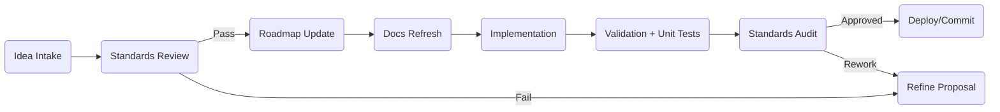

# AI Development Standards Pillar

**Purpose:** Establish a single authoritative governance standard for all human or AI-assisted development across applications, games, services, and web experiences.

**Executive Summary:**
- Enforces architectural integrity, documentation discipline, and accessibility-first communication.
- Applies to every repository, branch, feature, and experiment without exception.
- Embeds visual quick references (tables, diagrams, trees) for rapid comprehension by dyslexic and neurodivergent teammates.

**Date Created:** October 16, 2025  
**Last Updated:** December 11, 2025  
**Version:** 1.1.0

**Active Projects:**
- MXN.CHAT (Next.js, Supabase, Brevo) - `/DOCs/MXN/`
- MagicWRX (Next.js, Firebase) - `/DOCs/MagicWRX/` (planned)
- Template-WRX (Multi-template system) - `/DOCs/Template-WRX/` (planned)

---

## ✅ Non-Negotiable Compliance Suite

| Layer | Required Artifact | Key Contents | Visual Aid |
|-------|-------------------|--------------|------------|
| 1 | Harmony Overview | Purpose, doc index, executive summary, changelog cadence | ✅ Summary table |
| 2 | Executive Summary | Goals, constraints, acceptance criteria | ✅ Highlight callouts |
| 3 | Data Flow Diagram | Authoritative system interactions | ✅ ASCII / Mermaid flow |
| 4 | Linux Tree Snapshot | Directory + assembly layout | ✅ Tree block |
| 5 | Standards Log | Sign-off matrix for reviewers | ✅ Checklist table |

**Rule:** No code merges without all five artifacts refreshed and linked.

---

## 🧭 Core Engineering Principles (Always Active)

```
╔════════════════════════════════════════════════╗
║ SOLID • DRY • KISS • YAGNI • SSOT • COMPOSITION ║
║ SoC • Demeter • Explicitness • Clean Boundaries ║
║ Immutable Core                                  ║
╚════════════════════════════════════════════════╝
```

1. **SOLID & DRY:** Every module conforms to single responsibility; duplication triggers remediation.
2. **KISS:** Prefer the minimal viable design that passes acceptance tests; remove accidental complexity.
3. **YAGNI:** Reject speculative abstractions. Implement only what roadmapped features require today.
4. **Single Source of Truth:** Shared state originates from one owning service (e.g., `PlayerPrefsManager`).
5. **Composition Over Inheritance:** Build features from collaborating components, not deep hierarchies.
6. **Separation of Concerns:** Each file has one reason to change. UI cannot mutate core data directly.
7. **Law of Demeter:** Talk only to immediate collaborators; no chained lookups into foreign contexts.
8. **Explicitness:** Method names, side effects, and event emissions are obvious and documented in summaries.
9. **Clean Architecture Boundaries:** `Core` never references `UI`, Firebase, SDKs, or platform specifics.
10. **Immutable Core:** Domain data structures expose readonly state unless explicitly marked mutable.

Failure to apply any principle must be documented with mitigation and scheduled follow-up.

---

## 🔁 Compliance Workflow



- **Standards Review:** Validate roadmap alignment, dependencies, and data ownership.
- **Docs Refresh:** All documents listed in this standard must show updated timestamps and deltas.
- **Validation:** Add automated tests (unit/integration) and manual checklists for each acceptance path.
- **Audit:** Peers confirm compliance against this checklist before merge.

---

## 📊 Data Flow (Template)

```
┌──────────────┐   events/state   ┌────────────────────┐
│ Core Service │ ───────────────▶ │ Integration Layer  │
│ (Immutable)  │                  │ (SDK / API Bridge) │
└─────┬────────┘                  └────────┬──────────┘
      │ refresh snapshots                   │ exposes DTOs
      ▼                                     ▼
┌──────────────┐   renders/binds   ┌────────────────────┐
│ Domain Cache │ ───────────────▶ │ Presentation Layer │
└──────────────┘                  └────────────────────┘
```

Customize the node names per project. Every diagram update propagates to the roadmap and prompt documents.

---

## 🌲 Linux Tree Snapshot (Template)

```bash
$ tree -L 2 Docs
Docs
├── GENERIC/                      # Cross-project standards
│   ├── AI_STANDARDS.md           # This file
│   ├── GENERIC_AI_PROMPT.md      # AI orchestration template
│   └── GENERIC_DOC_INDEX.md      # Generic index template
│
├── MXN/                          # MXN.CHAT project (ACTIVE)
│   ├── DOC_INDEX.md              # MXN documentation index (SSOT)
│   ├── MXN_SYSTEM.md             # System overview
│   ├── MXN_TREE.md               # File structure
│   ├── MXN_ROADMAP.md            # Development phases
│   ├── MXN_SECURITY.md           # Security practices
│   ├── MXN_EMAIL_SETUP.md        # Email configuration
│   ├── MXN_AUTH_SETUP.md         # Authentication setup
│   ├── MXN_DEPLOYMENT_CICD.md    # Deployment procedures
│   └── MXN_SUPABASE_SCHEMA.md    # Database schema
│
└── [ProjectName]/                # Future projects follow this pattern
    ├── DOC_INDEX.md              # Project-specific index
    ├── [PROJECT]_SYSTEM.md       # System overview
    ├── [PROJECT]_TREE.md         # File structure
    ├── [PROJECT]_ROADMAP.md      # Development phases
    └── [PROJECT]_SECURITY.md     # Security practices
```

**Enforcement Rule:** Each repository **must** maintain this structure. Missing files halt releases.

---

## 🧪 Validation Checklist

| Check | Description | Owner | Status |
|-------|-------------|-------|--------|
| ✅ | Automated tests cover new behavior | Feature Dev | `Pass` |
| ✅ | Docs timestamps refreshed | Doc Steward | `Pass` |
| ✅ | Data flow & tree updated | Tech Lead | `Pass` |
| ✅ | Manual acceptance run | QA | `Pass` |
| ✅ | Accessibility review | UX | `Pass` |

Record checklist outcomes inside pull requests and sprint notes.

---

## 🛡 Deviations & Waivers

- **Request Process:** File a waiver in the project backlog with justification, risk assessment, and expiry date.
- **Mandatory Fields:** Impacted principles, mitigation plan, owner, and planned resolution sprint.
- **Auto-Expire:** Waivers older than two sprints reopen as blocking defects.

---

## 🔄 Continual Improvement Loop

1. **Retrospective Snapshot:** After each release, capture metrics (bugs escaped, doc drift incidents).
2. **Gap Analysis:** Map incidents to violated principles; update this document if process changes.
3. **Action Log:** Append remediation tasks to the roadmap with explicit owners and due dates.

---

## 📣 Accessibility & Visual Support

- Use high-contrast callouts, emoji legends, and ASCII boxes for quick scanning.
- Keep sentences short (max 20 words) and prefer active voice.
- Provide bullet-first summaries before deep detail.
- Offer audio/video summaries when possible (link in project index).

---

## 🔗 Required Companion Documents

### Generic (Cross-Project)
- `Docs/GENERIC/AI_STANDARDS.md` (this document)
- `Docs/GENERIC/GENERIC_AI_PROMPT.md`
- `Docs/GENERIC/GENERIC_DOC_INDEX.md`

### Project-Specific (Example: MXN.CHAT)
- `Docs/MXN/MXN_INDEX.md` - Central navigation and SSOT index
- `Docs/MXN/MXN_SYSTEM.md` - Executive summary and goals
- `Docs/MXN/MXN_TREE.md` - File structure and architecture
- `Docs/MXN/MXN_ROADMAP.md` - Development phases and milestones
- `Docs/MXN/MXN_SECURITY.md` - Security practices and key management

Each project directory references this standard in its DOC_INDEX.md first section.

---

## 📌 Action Reminder

> Before writing code, run through this document to confirm the environment, documentation set, and standards logs match the latest roadmap iteration.

All contributors acknowledge these standards by committing code. Non-compliance triggers immediate remediation or rollback.
