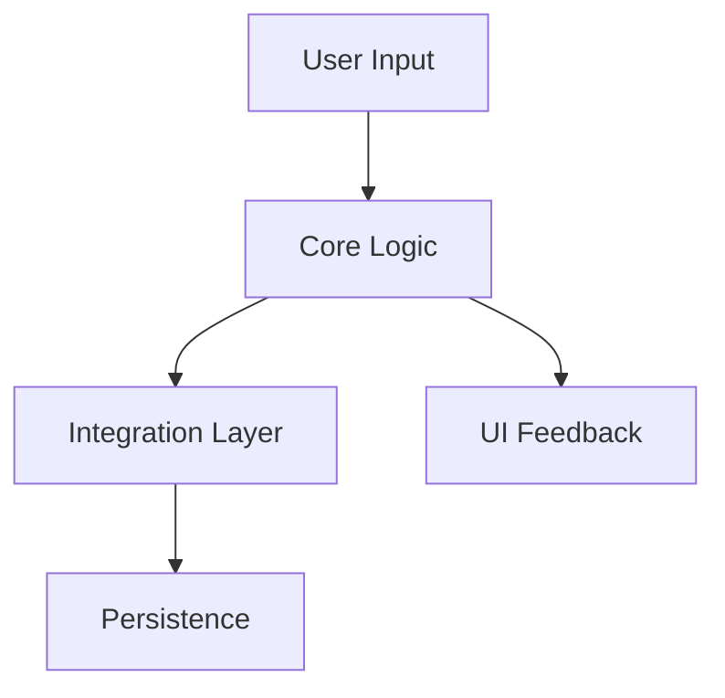

# GENERIC_ROADMAP.md

**Purpose:** Template roadmap for guiding MVP-focused delivery.

**Date Created:** October 16, 2025  \
**Last Updated:** October 16, 2025

---

## 🧭 Executive Summary

- **Mission:** `{{Describe product outcome in 2 sentences}}`
- **Guardrails:** Follow `AI_STANDARDS.md` + doc compliance suite.
- **Visual Cue:**
```
NOW ➜ NEXT ➜ LATER
 |      |       |
 Do     Prepare  Imagine
```

---

## ✅ Principles Alignment Table

| Principle | Application Example | Owner |
|-----------|---------------------|-------|
| SOLID/DRY | Single-responsibility services | Tech Lead |
| KISS | Minimal UI wiring | UI Lead |
| YAGNI | Defer non-roadmapped features | Product |
| SSOT | One data authority | Backend |
| Composition | Feature assembled from components | Engineering |

Update with project-specific commitments each iteration.

---

## 🔄 Now / Next / Later

### **NOW (0-2 Weeks)**
- `{{Task 1}}`
- `{{Task 2}}`
- `{{Task 3}}`

### **NEXT (2-6 Weeks)**
- `{{Task 4}}`
- `{{Task 5}}`
- `{{Task 6}}`

### **LATER (Backlog)**
- `{{Deferred Improvement}}`
- `{{Research Item}}`

---

## 🧪 Acceptance Checklist (Per Iteration)

```
[ ] Unit + integration tests updated
[ ] Docs (INDEX, ROADMAP, AI_PROMPT) timestamps refreshed
[ ] Data flow diagram updated
[ ] Linux tree snapshot current
[ ] Accessibility review completed
```

---

## 🔁 Data Flow Snapshot (Update Each Iteration)



Replace nodes with real modules; keep diagram synchronized with implementation.

---

## 🌲 Directory Tree Snapshot (Update Each Iteration)

```bash
$ tree -L 2 src
src
├── Core/
├── Integration/
├── UI/
└── Tests/
```

Align with the actual project layout.

---

## 🗂 Risk & Decision Log

| Date | Decision | Impact | Follow-Up |
|------|----------|--------|-----------|
| {{MM/DD}} | {{Decision}} | {{High/Med/Low}} | {{Owner + due}} |

---

## 📣 Communication Hooks

- **AI Prompt Link:** `Docs/AI_PROMPT.md`
- **Daily Standup Summary:** `{{Link or location}}`
- **Retro Notes:** `{{Link}}`

---

## 🛠 Maintenance Reminders

- Update this roadmap whenever scope changes.
- Reference completed tasks in the change timeline within `DOC_INDEX`.
- Archive sections after release, but keep historical diagrams in the repo.
