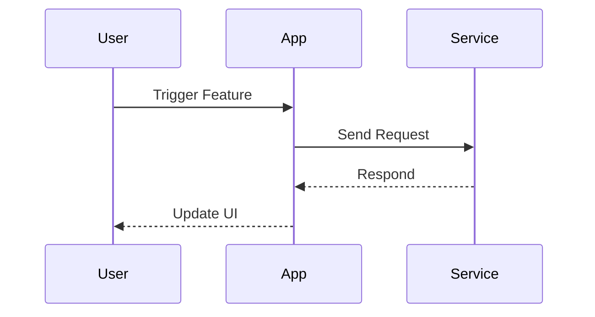

# GENERIC_TITLE_<ProjectName>.md

**Purpose:** Project-specific overview (replace `<ProjectName>` with actual title).

**Date Created:** October 16, 2025  \
**Last Updated:** October 16, 2025

---

## 🧭 Executive Snapshot

| Item | Detail | Visual Aid |
|------|--------|------------|
| Vision | `{{One-sentence mission}}` | ✅ Highlight |
| Primary Audience | `{{Who benefits}}` | ✅ Icon legend |
| Release Target | `{{Date or milestone}}` | ✅ Timeline |
| Doc Link Index | `Docs/DOC_INDEX.md` | ✅ Reference |

---

## 🎯 Objectives (Trim To Top 3)

- `{{Objective 1}}`
- `{{Objective 2}}`
- `{{Objective 3}}`

Illustrate progress using the bar below:
```
[#####-----] 50%
```

---

## 🔄 Lifecycle Diagram



Replace actors to match your project.

---

## 🌲 Repository Tree (High Level)

```bash
$ tree -L 1
.
├── Docs/
├── src/
├── tests/
└── tools/
```

Update depth or directories to reflect reality.

---

## ⚠ Risk & Mitigation Summary

| Risk | Likelihood | Mitigation |
|------|------------|------------|
| `{{Risk}}` | `High/Med/Low` | `{{Plan}}` |

---

## 📌 Alignment Checklist

```
[ ] AI_STANDARDS.md cited in this overview
[ ] Roadmap link verified
[ ] Doc index entry updated
[ ] Visual aids refreshed (diagram + tree)
[ ] Accessibility review performed
```
