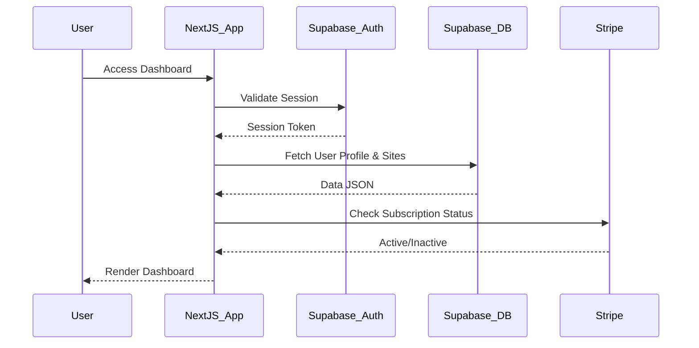

# MAGICWRX_1.0_HARMONY.md

**Purpose:** Project-specific overview for Magic WRX Platform.

**Date Created:** December 18, 2025  
**Last Updated:** December 18, 2025

---

## 🧭 Executive Snapshot

| Item | Detail | Visual Aid |
|------|--------|------------|
| Vision | A unified platform for business website creation, management, and growth. | ✅ Highlight |
| Primary Audience | Small Business Owners, Entrepreneurs, Agencies | ✅ Icon legend |
| Release Target | Q1 2026 | ✅ Timeline |
| Doc Link Index | [MAGICWRX_DOC_INDEX.md](./MAGICWRX_DOC_INDEX.md) | ✅ Reference |

---

## 🎯 Objectives

- **Unified Dashboard:** Consolidate site management, analytics, and billing into a single user-friendly interface.
- **Seamless Migration:** Transition from legacy Firebase architecture to a robust Supabase backend.
- **Scalable Architecture:** Implement a modular Next.js App Router structure to support future template expansion.

Illustrate progress using the bar below:
```
[#######---] 70%
```

---

## 🔄 Lifecycle Diagram



---
