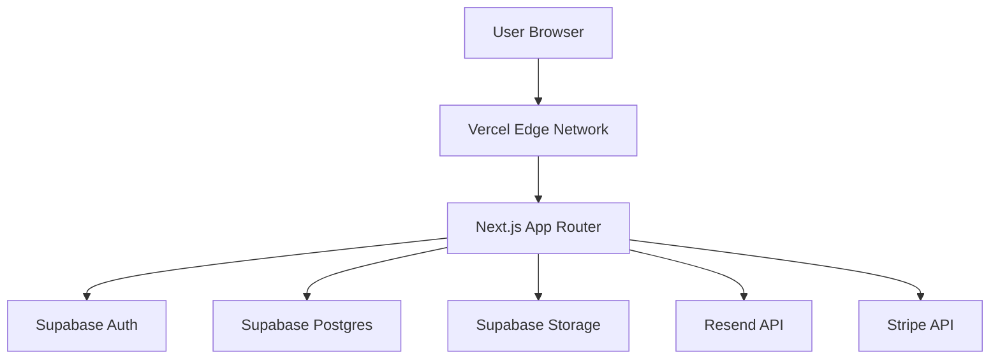

# MAGICWRX_SYSTEM.md

**Purpose:** System architecture and data flow documentation.

**Date Created:** December 18, 2025  
**Last Updated:** December 18, 2025

---

## 🏗️ System Architecture



---

## 🔄 Data Flow

### 1. User Authentication
1.  User submits credentials on `/login`.
2.  Client calls `supabase.auth.signInWithPassword`.
3.  Supabase returns JWT session.
4.  Next.js Middleware validates session on protected routes.

### 2. Site Creation
1.  User clicks "New Site" in Dashboard.
2.  App creates entry in `sites` table via Supabase Client.
3.  User redirected to `/sites/[id]/builder`.
4.  Editor loads initial template JSON.

### 3. Site Publishing
1.  User clicks "Publish".
2.  App updates `sites` table with `published: true`.
3.  (Future) Vercel API triggers deployment or ISR revalidation.

---

## 📂 Directory Structure (Source)

```bash
src/
├── app/
│   ├── (auth)/           # Login, Signup, Forgot Password
│   ├── (public)/         # Landing pages, Marketing
│   ├── (user)/           # Dashboard, Settings
│   ├── (admin)/          # Admin controls
│   ├── api/              # Route Handlers (Stripe, Chat)
│   └── sites/            # Site Builder & Preview
├── components/
│   ├── ui/               # Reusable UI atoms (Button, Input)
│   ├── builder/          # Drag-and-drop editor components
│   └── templates/        # Business template blocks
├── hooks/                # useSupabaseAuth, useSiteData
└── lib/                  # Supabase client, Stripe helper, Utils
```

---

## 🗄️ Database Schema (Supabase)

### `profiles`
- `id`: uuid (PK, FK to auth.users)
- `email`: text
- `full_name`: text
- `avatar_url`: text
- `role`: text ('user', 'admin')
- `created_at`: timestamp

### `sites`
- `id`: uuid (PK)
- `user_id`: uuid (FK to profiles.id)
- `name`: text
- `subdomain`: text (unique)
- `content`: jsonb (The site structure)
- `published`: boolean
- `created_at`: timestamp

---

## 📌 Alignment Checklist

```
[x] AI_STANDARDS.md cited
[x] Visual aids used
[x] Accessibility review
```
