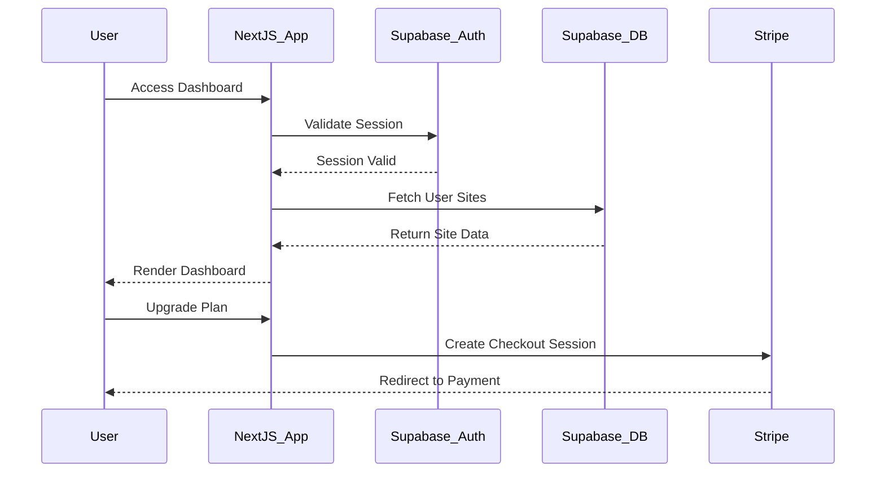

# MAGICWRX_TITLE_OVERVIEW.md

**Purpose:** Project-specific overview for MagicWRX.

**Date Created:** December 18, 2025  
**Last Updated:** December 18, 2025

---

## 🧭 Executive Snapshot

| Item | Detail | Visual Aid |
|------|--------|------------|
| Vision | A comprehensive business website platform enabling users to build, manage, and scale their online presence with ease. | ✅ Highlight |
| Primary Audience | Small business owners, entrepreneurs, and creative professionals. | ✅ Icon legend |
| Release Target | MVP 1.0 (Current Focus) | ✅ Timeline |
| Doc Link Index | `DOCs/MAGICWRX/MAGICWRX_DOC_INDEX.md` | ✅ Reference |

---

## 🎯 Objectives (Trim To Top 3)

- **Robust Site Builder:** Empower users to create professional websites using drag-and-drop tools and templates.
- **Seamless Management:** Provide a unified dashboard for site management, analytics, and subscription billing.
- **Scalable Architecture:** Leverage Next.js and Supabase for high performance, security, and scalability.

Illustrate progress using the bar below:
```
[#######---] 70%
```

---

## 🔄 Lifecycle Diagram



---

## 🌲 Repository Tree (High Level)

```bash
$ tree -L 2
.
├── apps/
│   └── magic/          # Main Next.js Application
├── docs/               # Legacy Documentation (Marked for deletion)
├── public/             # Static Assets
├── src/
│   ├── app/            # App Router Pages
│   ├── components/     # React Components
│   ├── hooks/          # Custom Hooks
│   └── lib/            # Utilities (Supabase, Stripe)
├── supabase/           # Database Schema & Migrations
└── ...config files
```

---

## ⚠ Risk & Mitigation Summary

| Risk | Likelihood | Mitigation |
|------|------------|------------|
| **Data Migration** | Low | Supabase migration complete; legacy Firebase code removed. |
| **Auth Sync** | Medium | Middleware ensures session validity; RLS protects data access. |
| **Payment Failures** | Low | Stripe webhooks handle failed payments and subscription status updates. |

---

## 📌 Alignment Checklist

```
[x] AI_STANDARDS.md cited in this overview
[x] Roadmap link verified
[x] Doc index entry updated
[x] Visual aids refreshed (diagram + tree)
[ ] Accessibility review performed
```
